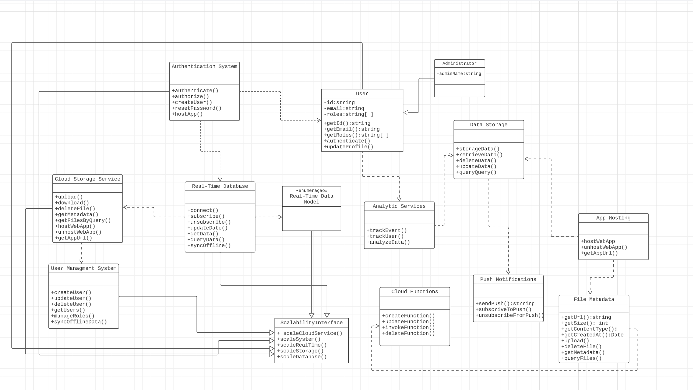

# Documentação do Sistema, Usando Modelagem de sistema orientados a objetos.

Este documento descreve as classes, métodos e relações no sistema de cloud da IVIPCOIN.

Servicos Existente entre o FIREBASE E O MONGODB

Usando Modelagem, será projetado um sistema usando diagramas de classes.

## Classes

### Authentication System

- `authenticate()`: Método para autenticar um usuário.
- `authorize()`: Método para autorizar um usuário.
- `createUser()`: Método para criar um novo usuário.
- `resetPassword()`: Método para redefinir a senha de um usuário.
- `hostApp()`: Método para hospedar um aplicativo.
- `storeData()`: Método para armazenar dados.
- `scaleSystem()`: Método para escalabilidade do sistema.
- `scaleCloudService()`: Método para escalabilidade de serviços em nuvem.

### Real-Time Database

- `connect()`: Método para conectar-se ao banco de dados em tempo real.
- `subscribe()`: Método para se inscrever em atualizações em tempo real.
- `unsubscribe()`: Método para cancelar a inscrição em atualizações em tempo real.
- `updateData()`: Método para atualizar dados em tempo real.
- `getData()`: Método para obter dados em tempo real.
- `queryData()`: Método para consultar dados em tempo real.
- `syncOffline()`: Método para sincronização offline.
- `scaleSystem()`: Método para escalabilidade do sistema.
- `scaleDatabase()`: Método para escalabilidade do banco de dados.
- `scaleRealTime()`: Método para escalabilidade em tempo real.
- `scaleCloudService()`: Método para escalabilidade de serviços em nuvem.

### Cloud Storage Service

- `upload()`: Método para fazer upload de arquivos.
- `download()`: Método para baixar arquivos.
- `deleteFile()`: Método para excluir arquivos.
- `getMetadata()`: Método para obter metadados de arquivos.
- `getFilesByQuery()`: Método para obter arquivos com base em consultas.
- `hostWebApp()`: Método para hospedar um aplicativo da web.
- `unhostWebApp()`: Método para desativar a hospedagem de um aplicativo da web.
- `getAppURL()`: Método para obter a URL de um aplicativo da web.
- `scaleStorage()`: Método para escalabilidade de armazenamento em nuvem.
- `scaleCloudService()`: Método para escalabilidade de serviços em nuvem.

### User Data

- `getId()`: Método para obter o ID de um usuário.
- `getEmail()`: Método para obter o email de um usuário.
- `getRoles()`: Método para obter as funções de um usuário.

### Analytic Service

- `trackEvent()`: Método para rastrear eventos e métricas.
- `trackUser()`: Método para rastrear informações de usuário.
- `analyzeData()`: Método para analisar dados e métricas.
- `scaleSystem()`: Método para escalabilidade do sistema.

### Data Storage

- `storeData()`: Método para armazenar dados.
- `retrieveData()`: Método para recuperar dados.
- `updateData()`: Método para atualizar dados.
- `deleteData()`: Método para excluir dados.
- `queryData()`: Método para consultar dados.
- `scaleStorage()`: Método para escalabilidade de armazenamento de dados.

### File Metadata

- `getMetadata()`: Método para obter metadados de arquivos.
- `scaleStorage()`: Método para escalabilidade de metadados.

### Cloud Functions

- `createFunction()`: Método para criar uma função na nuvem.
- `updateFunction()`: Método para atualizar uma função na nuvem.
- `invokeFunction()`: Método para invocar uma função na nuvem.
- `deleteFunction()`: Método para excluir uma função na nuvem.

### Push Notifications

- `sendPush()`: Método para enviar notificações push.
- `subscribeToPush()`: Método para se inscrever em notificações push.
- `unsubscribeFromPush()`: Método para cancelar a inscrição em notificações push.

### App Hosting

- `hostWebApp()`: Método para hospedar um aplicativo da web.
- `unhostWebApp()`: Método para desativar a hospedagem de um aplicativo da web.
- `getAppURL()`: Método para obter a URL de um aplicativo da web.

## Relações

- `Authentication System` usa `Real-Time Database` para gerenciar dados de usuário.
- `Authentication System` usa `Cloud Storage Service` para armazenar arquivos.
- `Real-Time Database` e `Cloud Storage Service` implementam `ScalabilityInterface` para fornecer escalabilidade ao sistema.
- `Real-Time Database` e `Cloud Storage Service` utilizam `User Data` para acessar informações do usuário.
- `Analytic Service` é responsável por rastrear eventos, métricas e análises no sistema.
- `Data Storage` lida com o armazenamento e gerenciamento de dados.
- `File Metadata` fornece metadados de arquivos.
- `Cloud Functions` oferece funcionalidades de funções na nuvem.
- `Push Notifications` lida com notificações push no sistema.
- `App Hosting` cuida da hospedagem de aplicativos da web.

