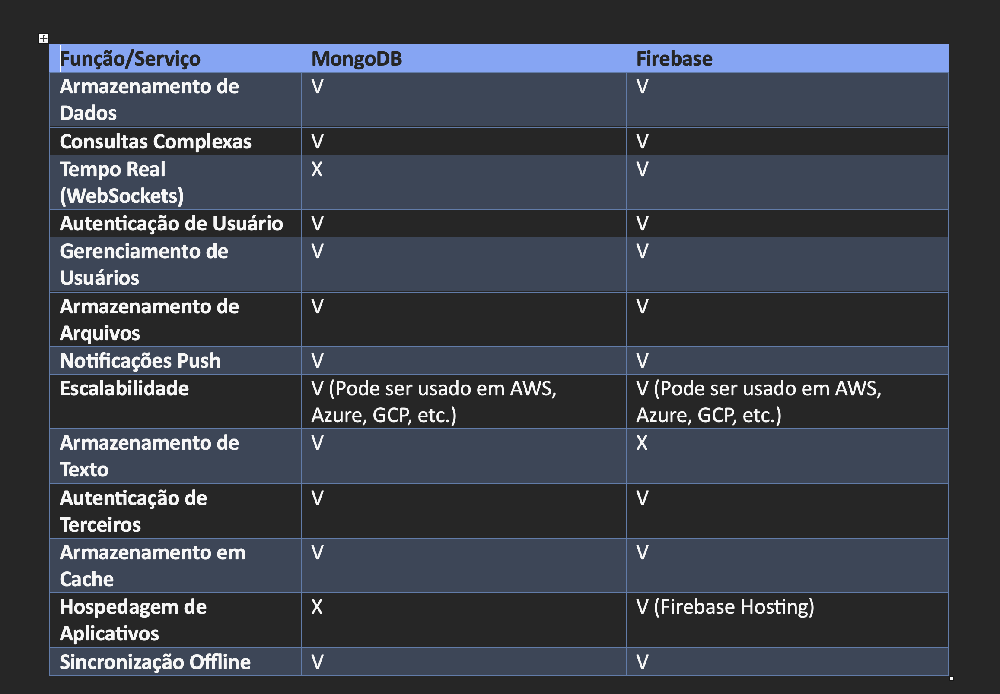

| Função                        | Firebase | MongoDB |
| ----------------------------- | -------- | ------- |
| **CRUD Básico**               |          |         |
| Criar documento               | V        | V       |
| Ler documento                 | V        | V       |
| Atualizar documento           | V        | V       |
| Excluir documento             | V        | V       |
| **Consultas**                 |          |         |
| Consulta simples              | V        | V       |
| Consulta avançada             | X        | V       |
| Ordenação                     | X        | V       |
| Filtro de documentos          | V        | V       |
| **Índices**                   |          |         |
| Gerenciamento de índices      | X        | V       |
| **Transações**                |          |         |
| Suporte a transações          | V        | V       |
| **Limitação de Resultados**   | V        | V       |
| **Agregações**                | X        | V       |
| **Segurança**                 |          |         |
| Autenticação de usuários      | V        | X       |
| Controle de acesso            | V        | V       |
| **Escalabilidade**            |          |         |
| Escalabilidade automática     | V        | V       |
| **Armazenamento de Arquivos** | V        | X       |
| **Geolocalização**            | V        | X       |

Connect to your MongoDB server:

```typescript
const MongoClient = require("mongodb").MongoClient;

MongoClient.connect("mongodb://localhost:27017", (err, client) => {
  if (err) throw err;

  const db = client.db("mydb");
  const collection = db.collection("users");
  // Perform operations on the collection here.
  client.close();
});
```

### CRUD Operations

Create Document

```typescript
collection.insertOne(
  {
    name: "Maria",
    age: 30,
    city: "Los Angeles",
  },
  (err, result) => {
    if (err) throw err;
    console.log("Document inserted successfully");
  }
);
```

Read Document

```typescript
collection.findOne({ name: "Maria" }, (err, doc) => {
  if (err) throw err;
  if (doc) {
    console.log("Document found:", doc);
  } else {
    console.log("No document found with the provided criteria.");
  }
});
```

Update Document

```typescript
collection.updateOne(
  { name: "Maria" },
  { $set: { age: 31, city: "New York" } },
  (err, result) => {
    if (err) throw err;
    console.log("Document updated successfully");
  }
);
```

Delete Document

```typescript
collection.deleteOne({ name: "Maria" }, (err, result) => {
  if (err) throw err;
  console.log("Document deleted successfully");
});
```

Advanced Queries

```typescript
collection
  .find({
    $and: [{ age: { $gte: 25 } }, { city: "New York" }],
  })
  .toArray((err, docs) => {
    if (err) throw err;
    console.log("Documents found:", docs);
  });
```

Sorting

```typescript
collection
  .find()
  .sort({ age: -1 })
  .toArray((err, docs) => {
    if (err) throw err;
    console.log("Documents found (sorted by age in descending order):", docs);
  });
```

### Firebase (usando JavaScript):

Consulta avançada:

```JavaScript
// Consulta avançada com Firebase
db.collection("usuarios")
  .where("idade", ">=", 25)
  .where("cidade", "==", "São Paulo")
  .get()
  .then((querySnapshot) => {
    querySnapshot.forEach((doc) => {
      console.log("Dados do documento:", doc.data());
    });
  })
  .catch((error) => {
    console.error("Erro na consulta: ", error);
  });

```

Ordenação:

```typescript
// Consulta com ordenação
db.collection("usuarios")
  .orderBy("idade", "desc")
  .get()
  .then((querySnapshot) => {
    querySnapshot.forEach((doc) => {
      console.log("Dados do documento:", doc.data());
    });
  })
  .catch((error) => {
    console.error("Erro na consulta: ", error);
  });
```

Filtro de documentos:

```typescript
// Consulta com filtro de documentos
db.collection("usuarios")
  .where("cidade", "==", "São Paulo")
  .get()
  .then((querySnapshot) => {
    querySnapshot.forEach((doc) => {
      console.log("Dados do documento:", doc.data());
    });
  })
  .catch((error) => {
    console.error("Erro na consulta: ", error);
  });
```

Limitação de Resultados:

```typescript
// Consultar com limite de resultados
db.collection("usuarios")
  .limit(5)
  .get()
  .then((querySnapshot) => {
    querySnapshot.forEach((doc) => {
      console.log("Dados do documento:", doc.data());
    });
  })
  .catch((error) => {
    console.error("Erro na consulta: ", error);
  });
```

Armazenamento de Dados de Geolocalização no Firebase Cloud Firestore

```typescript
const db = firebase.firestore();
db.collection("geolocations").add({
  latitude: 40.7128,
  longitude: -74.006,
  name: "Nova York",
});
```

```typescript
const GeoFirestore = require("geofirestore").GeoFirestore;
const GeoPoint = require("geofirestore").GeoPoint;

const db = firebase.firestore();
const geofirestore = new GeoFirestore(db);

const query = geofirestore.collection("geolocations");
const center = new GeoPoint(-22.9068, -43.1729); // Coordenadas do Rio de Janeiro
const radius = 10; // Raio em quilômetros

const queryResults = query.near({ center, radius });
queryResults.get().then((snapshot) => {
  snapshot.docs.forEach((doc) => {
    console.log("Localização encontrada:", doc.data());
  });
});
```


